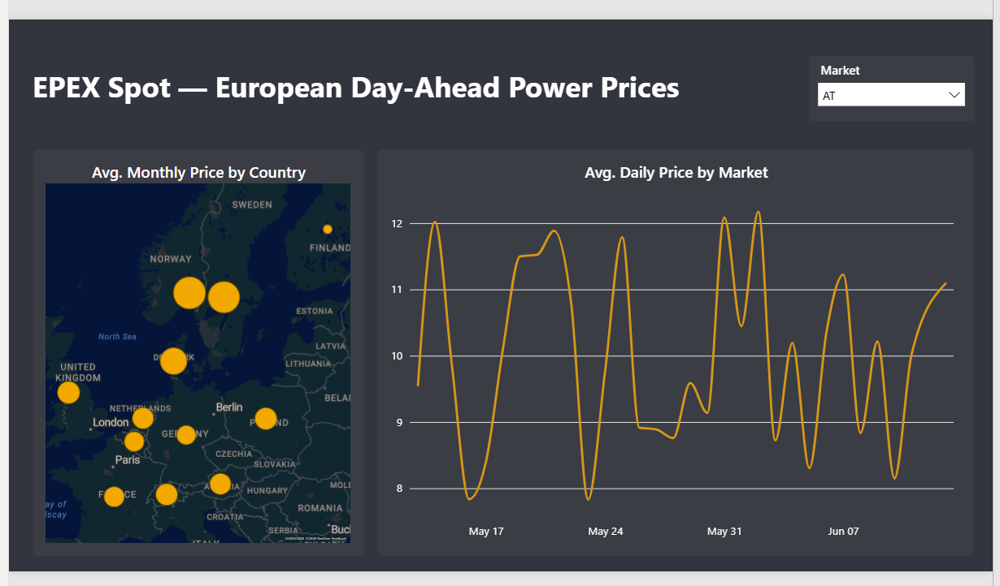
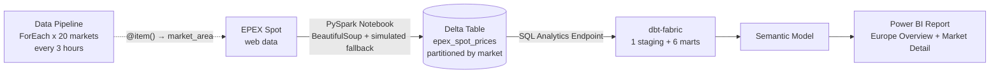

# EPEX Spot — European Day-Ahead Power Prices

End-to-end **Microsoft Fabric** project: Spark ingestion → Delta Lakehouse → Data Pipelines → dbt transformations → Power BI. European day-ahead electricity price analytics with an hour-by-hour battery charge/discharge advisor.



## Architecture



| Layer | Technology |
|---|---|
| Ingestion | PySpark Notebook (requests + BeautifulSoup4, deterministic simulated fallback) |
| Storage | OneLake — Delta table, partitioned by `market` |
| Orchestration | Fabric Data Pipeline (ForEach × 20 markets, 3-hour schedule) |
| Transformation | dbt-fabric via Lakehouse SQL Analytics Endpoint |
| Reporting | Power BI (Fabric) |

## Repository structure

```
├── fabric/     # Fabric workspace items (Git integration): notebook, pipeline, semantic model, report
├── dbt/        # dbt project: staging + marts, custom macro, sources
└── docs/       # screenshots
```

## Data flow

1. The **notebook** scrapes EPEX Spot day-ahead prices per market area. If scraping is unavailable, a deterministic simulator generates realistic intraday price curves (duck-curve shape, market-specific base prices) so the pipeline stays fully demonstrable.
2. First run creates the `epex_spot_prices` Delta table partitioned by `market`; subsequent runs **merge/upsert** with a literal partition predicate so 20 markets can write safely.
3. The **pipeline** loops over 20 European market areas (`ForEach` + `@item()` parameter passing) on a schedule.
4. **dbt** builds one staging view and six marts on the SQL endpoint:
   - `stg_epex_spot_prices` — type casting, country/region enrichment
   - `mrt_avg_price_per_month`, `mrt_avg_price_per_day`
   - `mrt_avg_price_per_day_transposed` — dynamic pivot via Jinja `run_query` loop
   - `mrt_lowest_price_per_day` / `mrt_highest_price_per_day` — shared logic via a custom macro
   - `mrt_simple_advice` — hour-by-hour battery charge/discharge recommendation
5. The **Power BI report** has a Europe overview page (map + daily price trend) and a market detail page with the battery advice table.

## Running dbt locally

```bash
conda create -n dbt_fabric python=3.11 -y
conda activate dbt_fabric
pip install dbt-fabric

az login --allow-no-subscriptions   # tenant-level access is enough for Fabric
cd dbt
dbt debug
dbt run
```

`profiles.yml` uses **Azure CLI authentication** — no secrets in the repo. Point `server` and `database` at your own Lakehouse SQL endpoint.

## Lessons learned

- **Schema-enabled lakehouses** require fully qualified names (`LH.dbo.table`) in Spark when no default lakehouse is pinned.
- `%pip` magic is **disabled in pipeline-triggered notebooks** — rely on runtime built-ins or Environment items.
- Parallel `MERGE` into one Delta table throws `ConcurrentAppendException` unless the merge predicate contains a **literal partition filter**.
- Small capacity SKUs hit Spark session limits fast (`TooManyRequestsForCapacity`) — *sequential ForEach* + *high-concurrency session sharing* solves it.
- dbt's `+schema:` config **appends** to the target schema by default (`dbo` + `dbo` → `dbo_dbo`).

## Credits

Based on the [dataroots Fabric end-to-end series](https://dataroots.io/blog/fabric-end-to-end-use-case-overview-architecture), updated for 2026 Fabric (schema-enabled lakehouses, session sharing, concurrency fixes).
